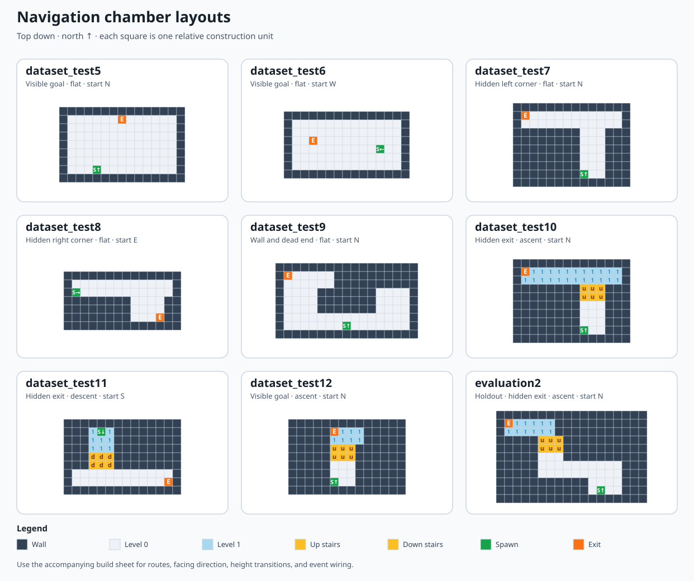

# Navigation chamber build sheet

These are **proposed** chambers for the next navigation dataset. Build the geometry in Puzzle Maker, then add the recording triggers in Hammer++ using [the local chamber setup procedure](../LOCAL_DATASET_CHAMBER_SETUP.md). `dataset_test5` through `dataset_test12` were unused when this sheet was written. Reserve `evaluation2` for model testing; do not add its demonstrations to the training cache if it is meant to measure generalization.



## How to read the plans

Each character is one square on a **relative construction grid**. Pick a single practical Puzzle Maker floor unit and use it for every square in a plan. An open run that is three characters wide should be three units wide. The plans specify geometry and route, not exact Hammer coordinates.

| Mark | Build |
|---|---|
| `#` | Full-height opaque wall or outside the chamber. Keep the exit hidden where specified. |
| `.` | Walkable floor at level 0. |
| `1` | Walkable landing at level 1, one modest stair/ramp flight above level 0. |
| `u` | Walkable stairs or ramp rising from level 0 to level 1 **when approached from the south**. The two rows of `u` form one flight. |
| `d` | Walkable stairs or ramp descending from level 1 to level 0 **when approached from the north**. The two rows of `d` form one flight. |
| `S` | Player spawn/entrance floor square. Facing direction and level are stated per map. The actual entrance door can be on an adjacent wall. |
| `E` | Exit/goal trigger floor square. Its floor level is stated per map. The actual exit door can be on an adjacent wall. |

North is the top of each drawing. Keep passages at least three grid squares wide as drawn. Make height transitions walkable at normal speed without a jump, and leave headroom above each flight. The exit must be a real finish point with `SignalGoalReached()`, not just a visible door. Put `SignalChamberReady()` where every reload reliably reaches it before recording should start. Use the [setup procedure](../LOCAL_DATASET_CHAMBER_SETUP.md) to check both events.

For the hidden-exit maps, walk the starting position in game and confirm the exit is outside the camera view **and** blocked by an opaque wall. Adjust wall height or entrance angle if the 2D drawing alone does not hide it. Keep the chambers bright enough that corners, stairs, and the floor edge are legible in the recorded 320×180 frames.

## Suggested set

| Map | Start | Route from spawn | Height | Exit visible at start? | Main variation |
|---|---|---|---|---|---|
| `dataset_test5` | North, level 0 | North and slightly right | Flat | Yes | Open-room start and steering |
| `dataset_test6` | West, level 0 | West and slightly north | Flat | Yes | Opposite starting direction |
| `dataset_test7` | North, level 0 | North, then left | Flat | No | Left corner |
| `dataset_test8` | East, level 0 | East, then right | Flat | No | Right corner from a different heading |
| `dataset_test9` | North, level 0 | Around the left side of a wall | Flat | No | Wall avoidance and a recoverable dead end |
| `dataset_test10` | North, level 0 | Up, then left | Rise to 1 | No | Stair ascent followed by a turn |
| `dataset_test11` | South, level 1 | Down, then left | Descend to 0 | No | Reverse height change and starting heading |
| `dataset_test12` | North, level 0 | Straight up the stairs | Rise to 1 | Yes, if the stairs preserve the sightline | Visible vertical goal |
| `evaluation2` | North, level 0 | North, left, up, then left | Rise to 1 | No | Held-out combination of learned pieces |

### `dataset_test5` — visible goal, open room

Spawn faces **north** on level 0; exit is level 0. The goal is ahead and a little to the right, within the initial view. This should teach movement from the first frame without a memorized corridor turn.

```text
###############
#......E......#
#.............#
#.............#
#.............#
#.............#
#.............#
#...S.........#
###############
```

### `dataset_test6` — visible goal from a west-facing start

Spawn faces **west** on level 0; exit is level 0. Keep the slight northward offset so a small camera correction is useful, while the exit remains visible.

```text
###############
#.............#
#.............#
#..E..........#
#..........S..#
#.............#
#.............#
###############
```

### `dataset_test7` — hidden left corner

Spawn faces **north** on level 0; exit is level 0. Walk north through the three-square passage, then turn left in the upper room. The solid block to the left of the lower passage hides the exit at spawn.

```text
##############
#E...........#
#............#
########...###
########...###
########...###
########...###
########...###
########S..###
##############
```

### `dataset_test8` — hidden right corner

Spawn faces **east** on level 0; exit is level 0. Walk east along the upper hall and turn right into the lower room. This changes both the starting heading and turn direction relative to `dataset_test7`.

```text
##############
#............#
#S...........#
########....##
########....##
########...E##
##############
```

### `dataset_test9` — central wall and dead-end recovery

Spawn faces **north** on level 0; exit is level 0. The wall directly ahead blocks the exit. The left side leads to the goal; the right side reaches a short dead end because the top-right floor is blocked. Build the upper walls high enough that the exit cannot be seen over the obstacle.

```text
#################
#E.....##########
#......##########
#....#######....#
#....#######....#
#....#######....#
#...............#
#.......S.......#
#################
```

For the main training runs, consistently take the left route. For recovery demonstrations, make a **separate spawn variant**: copy this layout, move `S` from row 8, column 9 to row 5, column 15 (counting from 1 at the top-left), and face north toward the dead-end wall. The route then turns around, goes south to the bottom hall, west around the central wall, and north to the exit. Give the variant its own map name, such as `dataset_test9_recovery`. This yields consistent first actions for each starting view; mixing left and right decisions from an identical spawn would give behavior cloning conflicting labels.

### `dataset_test10` — rise and turn left

Spawn faces **north** on level 0; exit is on level 1. Climb the two-row flight, enter the raised upper room, and turn left. `u` connects the `.` corridor to the `1` landing.

```text
##############
#E11111111111#
#111111111111#
########uuu###
########uuu###
########...###
########...###
########...###
########S..###
##############
```

Side view along the initial northward path:

```text
exit branch on level 1  ────────────── 1
                               ╱ ╱
spawn corridor at level 0 ────╱──────── 0
```

### `dataset_test11` — descend and turn left

Spawn faces **south** on level 1; exit is on level 0. Descend the two-row flight, enter the lower room, and turn left from the player's southward heading (east on the drawing). `d` connects the `1` corridor to the `.` landing.

```text
##############
###1S1########
###111########
###111########
###ddd########
###ddd########
#............#
#...........E#
##############
```

Side view along the initial southward path:

```text
spawn corridor at level 1 ────╲──────── 1
                               ╲ ╲
exit branch on level 0  ────────────── 0
```

### `dataset_test12` — visible goal above the start

Spawn faces **north** on level 0; exit is on level 1. Build an open stairwell so the raised exit is visible from the starting position when looking slightly upward. This isolates vertical movement from corner finding.

```text
##############
#####E111#####
#####1111#####
#####uuu######
#####uuu######
#####...######
#####...######
#####S..######
##############
```

### `evaluation2` — held-out corner plus ascent

Spawn faces **north** on level 0; exit is on level 1. The route goes north, left across the middle hall, up a flight, then left again. This combines pieces from the training plans but uses a new arrangement. Keep its geometry and appearance distinct from `dataset_test7` and `dataset_test10`.

```text
##################
#E11111###########
#111111###########
#####uuu##########
#####uuu##########
#####...##########
#####..........###
#####..........###
###########....###
###########.S..###
##################
```

## Recording and evaluation notes

- Build and hand-walk each chamber before collecting data. Check that the goal is reachable, the planned exit visibility matches the table, the stairs work without jumping, and the start/goal events each fire once on every reload.
- Keep the **first meaningful movement prompt** visually clear: a visible goal, a corridor opening, or a stairway. Do not make the correct turn depend on information the four-frame visual policy cannot see.
- For a given spawn view, keep the demonstrated first choice consistent. Vary route details and camera motion after the choice, and use separate spawn/map variants for substantially different recovery starts.
- Start with a 3–5 episode pilot on every training map and inspect the MP4s and action alignment. For the full pass, target roughly 50 successful runs in total on each new training chamber with repeated `--map` flags; the recorder cycles after each success. `--episodes` counts runs in the current invocation, so subtract pilot runs from the later quota if you want exactly 50 total. Training balances usable frames by chamber, so older or longer recordings do not dominate the batches.
- Keep `evaluation2` untouched until the candidate is trained. Compare repeated closed-loop success on `dataset_test1`, a few of these new training maps, `evaluation1`, and `evaluation2`. A low validation loss alone is not a navigation result.
